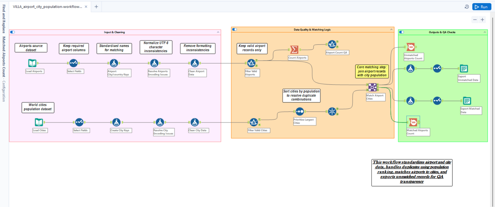
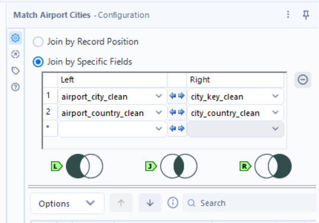
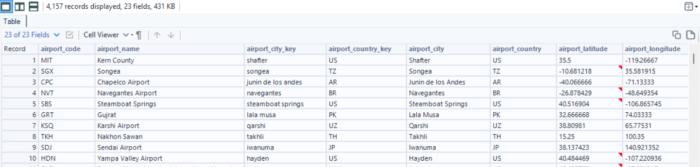
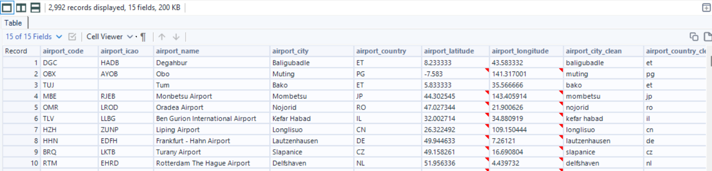
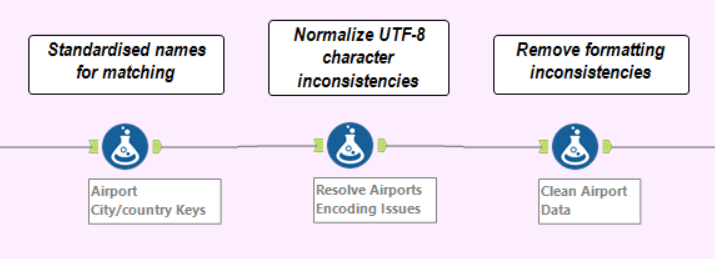
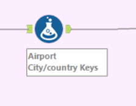
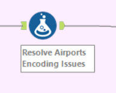
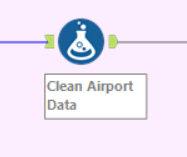

# Airport City Population Pipeline

An Alteryx workflow designed to match airport records with city and population data through cleaning, standardization, validation, and join logic.

---

# Project Overview

Inspired from a real task I got from a company, this project focuses on building a clean and structured data preparation pipeline in Alteryx, capable of:

- matching airport records with city and population datasets
- handling unmatched records separately
- standardizing inconsistent location naming
- extracting and structuring latitude and longitude information
- improving final dataset readability and usability

The workflow separates matched and unmatched outputs in order to support both successful integrations and further manual validation.

---

# Workflow Overview

## Full Workflow



---

# Join and Matching Logic



---

# Output Examples

## Matched Output



## Unmatched Output



---

# Repository Structure

```text
airport-city-population-pipeline
│
├── data
│   ├── sample_input
│   └── sample_output
│
├── workflow
│   └── airport_city_population_match.yxmd
│
├── screenshots
│
└── README.md
```

---

# Workflow Process

The workflow follows these main steps:

1. Import airport and city datasets
2. Clean and standardize location fields, in order to create keys for the matching
3. Normalize naming inconsistencies
4. Extract latitude and longitude information
5. Join airport records with city information
6. Separate matched and unmatched results, and count them
7. Export structured final datasets

---

# Detailed Workflow Explanation

## 1.
## 2.
## 3. Normalize naming inconsistencies

Before joining the airport and city datasets, the workflow applies multiple cleaning and normalization steps in order to improve match quality and reduce inconsistencies between records.
Moreover, these steps are a game changer for the final two outputs, since they improve a lot their readability.

Ths normalization process step is divided into two separate branches, as most of the workflow:

- Airport stream
- City stream

Each branch applies dedicated cleaning logic specific to the structure of the dataset.

The airport stream contains 3 Formula Tools responsible for:
- creating standardized matching keys
- resolving UTF-8 encoding inconsistencies
- validating airport records and extracting geographic information

---

### Airport Stream

#### Airport Stream Overview



---

### Tool 1 — Airport City/Country Keys

This Formula Tool creates standardized matching keys and extracts geographic coordinates from the airport location field.

##### Workflow Section



##### Columns Created

| Output Column | Purpose |
|---|---|
| `airport_city_key` | Standardized city matching key |
| `airport_country_key` | Standardized country matching key |
| `airport_longitude` | Extracted longitude coordinates |
| `airport_latitude` | Extracted latitude coordinates |

---

#### Formula 1 — airport_city_key

```text
LowerCase(Trim([airport_city]))
```

##### Purpose

This formula creates a standardized city key used during the matching process.

The transformation:
- removes leading and trailing spaces
- converts all values to lowercase
- reduces formatting inconsistencies between datasets

##### Why this is important

City names may contain:
- inconsistent capitalization
- unnecessary spaces
- formatting differences

Without standardization, these inconsistencies could cause failed joins or false unmatched records.
And even if the not-well-standardized records make it through the join correctly, they still are hard to read and work with, in the final outputs.

#### Formula 2 — airport_country_key

```text
UpperCase(Trim([airport_country]))
```

##### Purpose

This formula creates a standardized country key.

The transformation:
- removes unnecessary spaces
- converts country values to uppercase

##### Why this is important

Country values must remain consistent before matching operations.

This standardization improves join reliability across datasets.

#### Formula 3 — airport_longitude

```text
IF IsNull([airport_location]) OR
Trim([airport_location]) = "" THEN Null()
ELSE ToNumber(
REGEX_Replace(
[airport_location],
"POINT \(([-0-9]+\.[0-9]*) ([-0-9]+\.[0-9]*)\)",
"$1"
))
ENDIF
```

##### Purpose

This formula extracts longitude coordinates from the airport location field.

The source data stores coordinates using the following structure:

```text
POINT (longitude latitude)
```

##### What the formula does

The formula:
- validates that location data exists
- parses the POINT coordinate string
- extracts the longitude value using regular expressions
- converts the extracted value into a numeric field

##### Why this is important

Longitude values are required for:
- geographic analysis
- coordinate validation
- mapping workflows
- downstream analytical processes

#### Formula 4 — airport_latitude

```text
IF IsNull([airport_location]) OR
Trim([airport_location]) = "" THEN Null()
ELSE ToNumber(
REGEX_Replace(
[airport_location],
"POINT \(([-0-9]+\.[0-9]*) ([-0-9]+\.[0-9]*)\)",
"$2"
))
ENDIF
```

##### Purpose

This formula extracts latitude coordinates from the airport location field.

##### What the formula does

The formula:
- validates that location data exists
- parses the geographic POINT string
- extracts the latitude value using regular expressions
- converts the extracted value into a numeric field

##### Why this is important

Latitude coordinates allow the workflow to:
- structure geographic data correctly
- support mapping operations
- validate airport locations
  - even if extracting longitude and latitude was not explicitly required for this specific task, in the last years of working as a Data Analyst I have come to the conclusion that, when working with geospatial datasets, these are always good fields to keep around, clean and standardized
    - in this specific case, we could later on use them to double-check if airport-cities and country-cities correspond.
- improve downstream analytical usability

---

### Tool 2 — Resolve Airports Encoding Issues

This Formula Tool resolves UTF-8 encoding inconsistencies and standardizes airport-related text fields.

##### Workflow Section



##### Columns Created

| Output Column | Purpose |
|---|---|
| `airport_city_clean` | Cleaned and normalized airport city field |
| `airport_country_clean` | Cleaned and standardized airport country field |

---

#### Formula 1 — airport_city_clean

```text
Replace(
Replace(
Replace(
Replace(
Replace(
Replace(
Replace(
Replace(
LowerCase(Trim([airport_city_key])),
"ć","c"),
"é","e"),
"á","a"),
"è","e"),
"ö","o"),
"Ü","u"),
"Ä","a"),
"Ã","a")
```

##### Purpose

This formula standardizes airport city names and resolves UTF-8 encoding inconsistencies.

##### What the formula does

The transformation:
- converts values to lowercase
- removes unnecessary spaces
- replaces incorrectly encoded UTF-8 characters
- standardizes special characters inside airport city names

##### Why this is important

Source systems may contain:
- incorrectly encoded accented characters
- inconsistent character formatting
- encoding problems generated during file imports or exports in different formats

This step was actually not included in my first draft of this workflow.
But looking at the final outputs I soon realized that, without normalization, these inconsistencies may cause:
- failed joins
- duplicate records
- inaccurate grouping
- inconsistent matching behavior

#### Formula 2 — airport_country_clean

```text
LowerCase(Trim([airport_country_key]))
```

##### Purpose

This formula creates a clean and standardized airport country field.

##### What the formula does

The transformation:
- removes unnecessary spaces
- converts values to lowercase
- standardizes formatting consistency

##### Why this is important

Consistent country formatting improves:
- matching reliability
- join consistency
- downstream filtering and grouping operations

---

### Tool 3 — Clean Airport Data

This Formula Tool applies data quality validation logic and creates status flags used to identify records that are valid for matching.

##### Workflow Section



##### Columns Created

| Output Column | Purpose |
|---|---|
| `airport_dq_status` | Detailed data quality validation status |
| `airport_dq_flag` | Simplified validation classification |
| `airport_has_coordinates` | Coordinate availability indicator |

---

#### Formula 1 — airport_dq_status

```text
IF IsNull([airport_code]) OR
Trim([airport_code]) = "" THEN "Missing airport code"
ELSEIF IsNull([airport_city]) OR
Trim([airport_city]) = "" THEN "Missing airport city"
ELSEIF IsNull([airport_country]) OR
Trim([airport_country]) = "" THEN "Missing airport country"
ELSEIF IsNull([airport_location]) OR
Trim([airport_location]) = "" THEN "Missing airport location"
ELSE "Valid for matching"
ENDIF
```

##### Purpose

This formula validates critical airport fields before the matching process.

##### What the formula does

The validation logic checks whether important airport fields contain:
- null values
- empty strings
- incomplete records

The formula generates descriptive validation messages for each record
- I find this to be a very good practice, in order to make my outputs easily comprehensible even for the "non-tech" team members and colleagues
  - after all, this is the whole point of using Alteryx, isn´t it? ☺️

##### Why this is important

This improves:
- data quality transparency
- troubleshooting capability
- workflow auditability
- validation tracking

It also helps identify records that require manual review.

#### Formula 2 — airport_dq_flag

```text
IF [airport_dq_status]="Valid for matching"
THEN "Valid"
ELSE "Review"
ENDIF
```

##### Purpose

This formula creates a simplified data quality classification flag.

##### What the formula does

Records are categorized into:
- Valid
- Review

based on the previous validation logic.

##### Why this is important

This simplified flag makes it easier to:
- filter problematic records
- separate valid rows
- create downstream review workflows

#### Formula 3 — airport_has_coordinates

```text
IF IsNull([airport_latitude]) OR
IsNull([airport_longitude])
THEN 0
ELSE 1
ENDIF
```

##### Purpose

This formula checks whether coordinate extraction was successful.

##### What the formula does

The formula creates a binary coordinate availability flag:
- 1 = coordinates available
- 0 = coordinates missing

##### Why this is important

This field can later be used for:
- geographic validation
- filtering
- mapping workflows
- coordinate completeness analysis

## 4.

## 5. Join Airport Records with City Information

Before creating the final matched dataset, the workflow combines the cleaned airport stream with the cleaned city population stream.

This step is responsible for:
- connecting airport records with city demographic information
- validating the standardized matching keys
- separating matched and unmatched records
- preparing the final outputs for downstream analysis

---

### Workflow Section


---

### Join Tool – Matching Logic

The workflow uses an Alteryx Join Tool configured with:

```text
Join by Specific Fields
```

The matching fields are:

| Airport Dataset | City Population Dataset |
|---|---|
| `airport_city_clean` | `city_key_clean` |
| `airport_country_clean` | `city_country_clean` |

A record is considered a successful match only when:

```text
airport_city_clean = city_key_clean
AND
airport_country_clean = city_country_clean
```

---

### Purpose

This matching strategy creates a reliable relationship between:
- airport records
- city records
- country information
- population data

The workflow intentionally uses two matching keys instead of only the city name:
- this reduces false matches and improves the overall reliability of the dataset.

---

### Why this is important

Many cities may exist in multiple countries.

Examples:
- London
- Paris
- San José
- Santiago

Using only the city name could create incorrect joins between unrelated records.

By matching:
- city
AND
- country

the workflow significantly improves match precision.

The cleaned fields are also essential because the Join Tool performs exact matching.

Without normalization, small differences such as:
- capitalization
- extra spaces
- punctuation
- accents
- abbreviations

could prevent otherwise valid matches.

---

### Join Outputs

The Join Tool generates three separate outputs:
- L Output
- J Output
- R Output

---

#### L Output – Unmatched Airport Records

The L output contains airport records that did not find a matching city population record.

These unmatched records are useful for:
- data quality validation
- identifying missing population records
- detecting normalization inconsistencies
- understanding unmatched airport coverage

Possible causes include:
- missing city records
- inconsistent naming
- incomplete normalization
- airports located in smaller cities not included in the population dataset

---

#### J Output – Successfully Matched Records

The J output contains all successfully matched airport and city records.

This is the primary enriched dataset generated by this step.

The output combines:
- airport information
- geographic information
- city information
- demographic information

This matched dataset is used for the downstream workflow steps and final outputs.

---

#### R Output – Unmatched City Records

The R output contains city population records that did not match any airport record.

These records are not necessarily errors.

They may represent:
- cities without airports
- unused demographic records
- cities outside the airport dataset scope
- additional population entries not required in the final analysis

---

### Column Selection Strategy

After the Join Tool, Select Tools are used to clean and organize the outputs.

The workflow intentionally keeps only the most relevant fields needed for analysis and reporting.

Examples of retained fields:
- airport identifiers
- airport name
- cleaned matching keys
- latitude and longitude
- city information
- population values
- reporting fields

Examples of removed fields:
- duplicate join keys
- temporary cleaning fields
- redundant metadata
- duplicated columns from both inputs
- intermediate workflow columns

---

### Purpose of the Final Matched Dataset

This step creates the core relationship between airports and city demographic information.


## 6.

## 7. 

--- 

# Sample Files Included

The repository includes small sample datasets and outputs to demonstrate the workflow logic without requiring large raw datasets nor giving out datasets provided to me by the company.

Included:
- sample airport input data
- sample city input data
- sample matched output
- sample unmatched output

---

# Tools Used

- Alteryx Designer
- Join Tool
- Formula Tool
- Select Tool
- Data Cleansing Tool
- Output Data Tool

---

# Purpose

This project is inspired by a real-world task given to me by a European company active in the field of Aviation Financial Data Analysis. I built as a portfolio-ready data preparation and reconciliation workflow demonstrating practical data cleaning, transformation, matching, and validation techniques using Alteryx.
